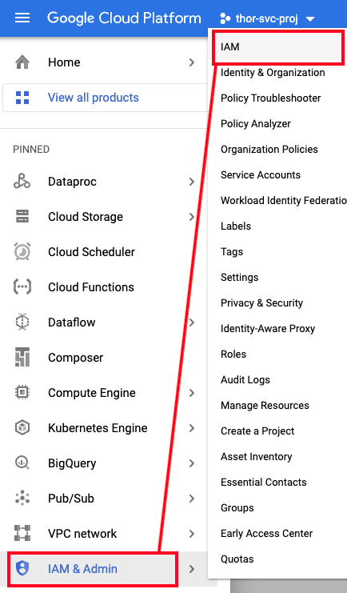

# About

This module covers the foundational one-time GCP setup to start working on Cloud Composer based Data Analytics endeavors on GCP.

In this module, we will cover the folowing-<br>
[1. Pre-requisites](01-foundational-setup.md#1-pre-requisites)<br>
[2. Variables for use in the module](01-foundational-setup.md#2-variables-for-use-in-the-module)<br>
[3. Enable requisite Google APIs for Project Indra](01-foundational-setup.md#3-enable-requisite-google-apis)<br>
[4. Update organizational policies](01-foundational-setup.md#4-update-organizational-policies)<br>
[5. Create a User Managed Service Account (UMSA)](01-foundational-setup.md#5-create-a-user-managed-service-account-umsa)<br>
[6. Grant IAM Permissions](01-foundational-setup.md#6-grant-iam-permissions)<br>
[7. Permissions specific to Cloud Composer](01-foundational-setup.md#7-permissions-specific-to-cloud-composer)<br>
[8. Permissions specific to Cloud Functions](01-foundational-setup.md#8-permissions-specific-to-cloud-functions)<br>
[9. Permissions specific to Cloud Dataflow](01-foundational-setup.md#9-permissions-specific-to-cloud-dataflow)<br>
[10. Permissions specific to Cloud Storage](01-foundational-setup.md#10-permissions-specific-to-cloud-storage)<br>
[11. Permissions specific to BigQuery](01-foundational-setup.md#11-permissions-specific-to-bigquery)<br>
[12. Permissions specific to Cloud Composer 2 infrastructure](01-foundational-setup.md#12-permissions-specific-to-google-managed-default-service-accounts)<br>


## Duration
~ 1 hour+-

## Dependencies
None, but the rest of the modules are dependent on this module being successfully completed.


## 1. Pre-requisites 

Create a GCP project. You will need administrator privileges to the organization and owner privileges for the project for the rest of the modules.<br>
The author's service project (for data analytics) is called "thor-svc-proj"<br>

From the cloud console project dashboard, capture the project number. We will need to reference the project ID and project number for the rest of the modules.<br>


<hr style="border:12px solid gray"> </hr>
<br>

## 2. Variables for use in the module

In Cloud Shell, lets create some variables we will use for the rest of the project-
```
PROJECT_KEYWORD="thor"
SVC_PROJECT_NUMBER=509862753528  # Replace with your project's
SVC_PROJECT_ID=$PROJECT_KEYWORD-svc-proj  # Replace with your project's
UMSA="$PROJECT_KEYWORD-sa"
UMSA_FQN=$UMSA@$SVC_PROJECT_ID.iam.gserviceaccount.com
ADMIN_FQ_UPN="admin@akhanolkar.altostrat.com" # Replace with your Argolis UPN
```

<hr style="border:12px solid gray"> </hr>
<br>

## 3. Enable requisite Google APIs

Launch cloud shell, change scope to the project you created (if required), and run the below commands-

```
gcloud services enable orgpolicy.googleapis.com
gcloud services enable compute.googleapis.com
gcloud services enable container.googleapis.com
gcloud services enable containerregistry.googleapis.com
gcloud services enable composer.googleapis.com
gcloud services enable monitoring.googleapis.com 
gcloud services enable cloudtrace.googleapis.com 
gcloud services enable clouddebugger.googleapis.com 
gcloud services enable bigquery.googleapis.com 
gcloud services enable storage.googleapis.com
gcloud services enable cloudfunctions.googleapis.com
gcloud services enable pubsub.googleapis.com
gcloud services enable dataflow.googleapis.com
gcloud services enable dns.googleapis.com
gcloud services enable sqladmin.googleapis.com
gcloud services enable vpcaccess.googleapis.com 
```


<hr style="border:12px solid gray"> </hr>
<br>


## 4. Update organizational policies

Applicable for Google Customer Engineers working in Argolis-

a) Create variables for use further in the rest of project in cloud shell
<br>
Refer section 2, above

b) Relax require OS Login
```
rm os_login.yaml

cat > os_login.yaml << ENDOFFILE
name: projects/${SVC_PROJECT_ID}/policies/compute.requireOsLogin
spec:
  rules:
  - enforce: false
ENDOFFILE

gcloud org-policies set-policy os_login.yaml 

rm os_login.yaml
```

c) Disable Serial Port Logging

```

rm disableSerialPortLogging.yaml

cat > disableSerialPortLogging.yaml << ENDOFFILE
name: projects/${SVC_PROJECT_ID}/policies/compute.disableSerialPortLogging
spec:
  rules:
  - enforce: false
ENDOFFILE

gcloud org-policies set-policy disableSerialPortLogging.yaml 

rm disableSerialPortLogging.yaml

```

d) Disable Shielded VM requirement

```

shieldedVm.yaml 

cat > shieldedVm.yaml << ENDOFFILE
name: projects/$SVC_PROJECT_ID/policies/compute.requireShieldedVm
spec:
  rules:
  - enforce: false
ENDOFFILE

gcloud org-policies set-policy shieldedVm.yaml 

rm shieldedVm.yaml 

```

e) Disable VM can IP forward requirement

```
rm vmCanIpForward.yaml

cat > vmCanIpForward.yaml << ENDOFFILE
name: projects/$SVC_PROJECT_ID/policies/compute.vmCanIpForward
spec:
  rules:
  - allowAll: true
ENDOFFILE

gcloud org-policies set-policy vmCanIpForward.yaml

rm vmCanIpForward.yaml

```

f) Enable VM external access 

```

rm vmExternalIpAccess.yaml

cat > vmExternalIpAccess.yaml << ENDOFFILE
name: projects/$SVC_PROJECT_ID/policies/compute.vmExternalIpAccess
spec:
  rules:
  - allowAll: true
ENDOFFILE

gcloud org-policies set-policy vmExternalIpAccess.yaml

rm vmExternalIpAccess.yaml

```

g) Enable restrict VPC peering

```
rm restrictVpcPeering.yaml

cat > restrictVpcPeering.yaml << ENDOFFILE
name: projects/$SVC_PROJECT_ID/policies/compute.restrictVpcPeering
spec:
  rules:
  - allowAll: true
ENDOFFILE

gcloud org-policies set-policy restrictVpcPeering.yaml

rm restrictVpcPeering.yaml

```


h) Configure ingress settings for Cloud Functions

```
rm gcf-ingress-settings.yaml

cat > gcf-ingress-settings.yaml << ENDOFFILE
name: projects/$SVC_PROJECT_ID/policies/cloudfunctions.allowedIngressSettings
spec:
  rules:
  - allowAll: true
ENDOFFILE

gcloud org-policies set-policy gcf-ingress-settings.yaml

rm gcf-ingress-settings.yaml

```

i) Validation<br>
To describe a particular constratint, run like the below describes the constraint for cloud function ingress setting for the author's project-
```
gcloud org-policies describe \
cloudfunctions.allowedIngressSettings --project=$SVC_PROJECT_ID
```

Author's output:
```
name: projects/xxxnn/policies/cloudfunctions.allowedIngressSettings
spec:
  etag: CPz46Y4GELiOlfQB
  rules:
  - values:
      allowedValues:
      - ALLOW_ALL
  updateTime: '2022-01-09T06:11:08.512051Z'
  
 ```

<hr style="border:12px solid gray"> </hr>
<br>

## 5. Create a User Managed Service Account (UMSA)

We will use this UMSA as the runtime service account in the Data Analytics hands on labs that complement this repository-

```
gcloud iam service-accounts create ${UMSA} \
    --description="User Managed Service Account for the $PROJECT_KEYWORD Service Project" \
    --display-name=$UMSA 
```


<br>
<hr style="border:12px solid gray"> </hr>
<br>


## 6. Grant IAM Permissions 

### 6.1. General permissions specific to UMSA

#### 6.1.a. Service Account User role for UMSA

```
gcloud projects add-iam-policy-binding ${SVC_PROJECT_ID} \
    --member=serviceAccount:${UMSA_FQN} \
    --role=roles/iam.serviceAccountUser   
```

#### 6.1.b. Service Account Token Creator role for UMSA

```
gcloud projects add-iam-policy-binding ${SVC_PROJECT_ID} \
    --member=serviceAccount:${UMSA_FQN} \
    --role=roles/iam.serviceAccountTokenCreator  
```


### 6.2. Permissions for the lab attendee

### 6.1.c. Permission to operate as the UMSA

```
gcloud iam service-accounts add-iam-policy-binding \
    ${UMSA_FQN} \
    --member="user:${ADMIN_FQ_UPN}" \
    --role="roles/iam.serviceAccountUser"
    
gcloud iam service-accounts add-iam-policy-binding \
    ${UMSA_FQN} \
    --member="user:${ADMIN_FQ_UPN}" \
    --role="roles/iam.serviceAccountTokenCreator"
```

<hr style="border:12px solid gray"> </hr>
<br>


## 7. Permissions specific to Cloud Composer

### 7.a. Cloud Composer Administrator role for UMSA

```
gcloud projects add-iam-policy-binding ${SVC_PROJECT_ID} \
    --member=serviceAccount:${UMSA_FQN} \
    --role=roles/composer.admin
```

### 7.b. Cloud Composer Worker role for UMSA

```
gcloud projects add-iam-policy-binding ${SVC_PROJECT_ID} \
    --member=serviceAccount:${UMSA_FQN} \
    --role=roles/composer.worker
```

### 7.c. Cloud Composer ServiceAgentV2Ext role for Composer Google Managed Service Agent Account (CGMSAA)

This account is visible in IAM on Cloud Console only when the "Include Google Provided Role Grants" check box is checked.
This service accounts gets auto-created in the project when the Google API for Composer is enabled.

```
SVC_PROJECT_CGMSAA_FQN=service-${SVC_PROJECT_NUMBER}@cloudcomposer-accounts.iam.gserviceaccount.com

gcloud projects add-iam-policy-binding ${SVC_PROJECT_ID} \
    --member=serviceAccount:${SVC_PROJECT_CGMSAA_FQN} \
    --role roles/composer.ServiceAgentV2Ext
```


### 7.d. Permissions for operator (lab attendee) to be able to change configuration of Composer 2 environment and such

```
gcloud projects add-iam-policy-binding ${SVC_PROJECT_ID} \
    --member=user:${ADMIN_FQ_UPN} \
    --role roles/composer.admin

```

### 7.e. Permissions for operator (lab attendee) to be able to manage the Composer 2 GCS buckets and environments


```
gcloud projects add-iam-policy-binding ${SVC_PROJECT_ID} \
    --member=user:${ADMIN_FQ_UPN} \
    --role roles/composer.environmentAndStorageObjectViewer
```

### 7.f. Permissions for default compute engine service account to pull images from Container Registry 

```
SVC_PROJECT_DEFAULT_GCE_GMSA=$SVC_PROJECT_NUMBER-compute@developer.gserviceaccount.com
gcloud projects add-iam-policy-binding ${SVC_PROJECT_ID} \
    --member=serviceAccount:${SVC_PROJECT_DEFAULT_GCE_GMSA} \
    --role roles/editor
```


<hr style="border:12px solid gray"> </hr>
<br>


## 8. Permissions specific to Cloud Functions

### 8.1. Permissions specific to UMSA

### 8.1.a. Permission for UMSA to operate as a GCF service agent


Docs: https://airflow.apache.org/docs/apache-airflow-providers-google/stable/operators/cloud/functions.html

```
gcloud iam service-accounts add-iam-policy-binding \
  ${SVC_PROJECT_ID}@appspot.gserviceaccount.com \
  --member="serviceAccount:${UMSA_FQN}" \
  --role="roles/iam.serviceAccountUser"

gcloud projects add-iam-policy-binding ${SVC_PROJECT_ID} --member=serviceAccount:$UMSA_FQN --role=roles/cloudfunctions.serviceAgent
```

### 8.1.b. Permission for UMSA to operate as a GCF admin

```
gcloud projects add-iam-policy-binding ${SVC_PROJECT_ID} --member=serviceAccount:$UMSA_FQN --role=roles/cloudfunctions.admin
```

### 8.1.c. Permission for UMSA to operate as a GCF Developer

```
gcloud projects add-iam-policy-binding ${SVC_PROJECT_ID} --member=serviceAccount:$UMSA_FQN --role=roles/cloudfunctions.developer
```

<hr style="border:12px solid gray"> </hr>
<br>
<br>


## 9. Permissions specific to Cloud Dataflow

### 9.1. Permissions for UMSA to spawn Cloud Dataflow pipelines

a) Dataflow worker
```
gcloud projects add-iam-policy-binding ${SVC_PROJECT_ID} --member=serviceAccount:$UMSA_FQN --role=roles/dataflow.worker
```

b) To Dataflow developer
```
gcloud projects add-iam-policy-binding ${SVC_PROJECT_ID} --member=serviceAccount:$UMSA_FQN --role=roles/dataflow.worker
``` 


<hr style="border:12px solid gray"> </hr>
<br>


## 10. Permissions specific to Cloud Storage

### 10.1. Permissions for UMSA to read from GCS

a) ObjectViewer
```
gcloud projects add-iam-policy-binding $SVC_PROJECT_ID --member=serviceAccount:$UMSA_FQN --role="roles/storage.objectViewer"
```


## 11. Permissions specific to BigQuery

### 11.1. Permissions for UMSA to interact with BigQuery

```
gcloud projects add-iam-policy-binding $SVC_PROJECT_ID --member=serviceAccount:$UMSA_FQN \
--role="roles/bigquery.dataEditor"


gcloud projects add-iam-policy-binding $SVC_PROJECT_ID --member=serviceAccount:$UMSA_FQN \
--role="roles/bigquery.admin"

```

## 12. Permissions specific to Google Managed Default Service Accounts

### 12.1. Permissions for GCE Default GMSA to interact/download from container registry

```
SVC_PROJECT_GCE_DEFAULT_GMSA=$SVC_PROJECT_NUMBER-compute@developer.gserviceaccount.com

gcloud projects add-iam-policy-binding $SVC_PROJECT_ID --member=serviceAccount:$SVC_PROJECT_GCE_DEFAULT_GMSA \
--role="roles/editor"
```

<hr style="border:12px solid gray"> </hr>
<br>

## 13. IAM permissions recap

### 13.1. UMSA




### 13.2. Lab attendee/operator


### 13.3. Cloud Composer Agent


### 13.4. Google Managed Default Service Accounts


<br>
<br>
<hr>

This concludes the module, proceed to the [next module](02a-secure-cc2-iteration1-foundations.md).
