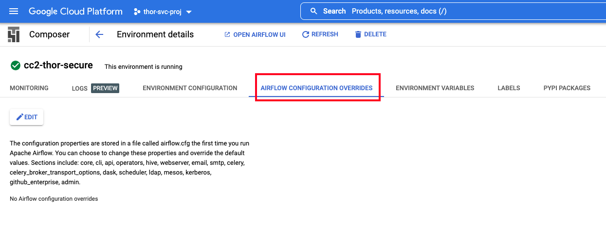
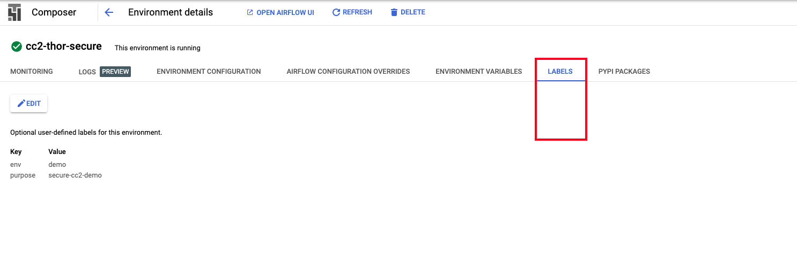

# About

This section covers provisioning a secure Cloud Composer 2 environment but without VPC-SC and PSC.<br>
This entire module is run in the service project (data analytics project).

## 1. Dependencies

Completion of the prior module.

## 2. Variables used in the project

In Cloud shell scoped to the service project, declare the below-
```
PROJECT_KEYWORD="thor"  # Replace with your keyword from module 1


ORG_ID=akhanolkar.altostrat.com                              #Replace with yours
ORG_ID_NBR=236589261571                                      #Replace with yours

SVC_PROJECT_NUMBER=509862753528                              #Replace with yours
SVC_PROJECT_ID=$PROJECT_KEYWORD-svc-proj                     

SHARED_VPC_HOST_PROJECT_ID=$PROJECT_KEYWORD-host-proj        #Shared VPC project - replace with yours
SHARED_VPC_HOST_PROJECT_NUMBER=239457183145                  #Shared VPC project - replace with yours


UMSA="$PROJECT_KEYWORD-sa"
UMSA_FQN=$UMSA@$SVC_PROJECT_ID.iam.gserviceaccount.com
ADMIN_FQ_UPN="admin@akhanolkar.altostrat.com"               #Replace with yours

COMPOSER_ENV_NM=cc2-$PROJECT_KEYWORD-secure
LOCATION=us-central1


SHARED_VPC_NETWORK_NM=$PROJECT_KEYWORD-shared-vpc
SHARED_VPC_NETWORK_FQN="projects/$SHARED_VPC_HOST_PROJECT_ID/global/networks/$SHARED_VPC_NETWORK_NM"
SHARED_VPC_CC2_SNET_NM="$PROJECT_KEYWORD-shared-cc2-snet"
SHARED_VPC_CC2_SNET_FQN="projects/$SHARED_VPC_HOST_PROJECT_ID/regions/$LOCATION/subnetworks/$SHARED_VPC_CC2_SNET_NM"
SHARED_VPC_CC2_SNET_CIDR_BLK='10.65.61.0/24'

GKE_CNTRL_PLN_CIDR_BLK='10.65.62.0/24' # GKE master
CC2_CIDR_BLK='10.65.63.0/24'  # Composer network
CSQL_CIDR_BLK='10.65.64.0/24' # Cloud SQL (Composer metastore)

OFFICE_CIDR=98.222.97.10/32 # Lab attendee's Public IP or your organization's office CIDR block for Airflow UI access
SERVERLESS_VPC_ACCESS_CONNECTOR_CIDR='10.70.0.0/28' # For event driven orchestration (GCF) to work

CC2_IMAGE_VERSION=composer-2.0.2-airflow-2.1.4  #composer-2.0.0-airflow-2.1.4
```


## 3. Provision "private" Cloud Composer 2 with shared VPC

From cloud shell in your service project/data analytics project, run the command below-

```
gcloud beta composer environments create $COMPOSER_ENV_NM \
    --image-version $CC2_IMAGE_VERSION \
    --labels env=demo,purpose=secure-cc2-demo \
    --location $LOCATION \
    --enable-private-environment \
    --network $SHARED_VPC_NETWORK_FQN \
    --subnetwork $SHARED_VPC_CC2_SNET_FQN \
    --cluster-secondary-range-name composer-pods \
    --services-secondary-range-name composer-services \
    --master-ipv4-cidr $GKE_CNTRL_PLN_CIDR_BLK \
    --composer-network-ipv4-cidr $CC2_CIDR_BLK \
    --cloud-sql-ipv4-cidr $CSQL_CIDR_BLK \
    --service-account $UMSA_FQN \
    --enable-master-authorized-networks \
    --master-authorized-networks ${OFFICE_CIDR} \
    --web-server-allow-all
```


Once supported by the product, we can restrict the Airflow webserver to specific CIDRs including that of the serverless VPC Connector subnet with this provisioning command-
```
gcloud beta composer environments create $COMPOSER_ENV_NM \
    --image-version $CC2_IMAGE_VERSION \
    --labels env=demo,purpose=secure-cc2-demo \
    --location $LOCATION \
    --enable-private-environment \
    --network $SHARED_VPC_NETWORK_FQN \
    --subnetwork $SHARED_VPC_CC2_SNET_FQN \
    --cluster-secondary-range-name composer-pods \
    --services-secondary-range-name composer-services \
    --master-ipv4-cidr $GKE_CNTRL_PLN_CIDR_BLK \
    --composer-network-ipv4-cidr $CC2_CIDR_BLK \
    --cloud-sql-ipv4-cidr $CSQL_CIDR_BLK \
    --service-account $UMSA_FQN \
    --enable-master-authorized-networks \
    --master-authorized-networks ${OFFICE_CIDR} \
    --web-server-allow-ip ip_range=${OFFICE_CIDR},description="Office CIDR" \
    --web-server-allow-ip ip_range=${SERVERLESS_VPC_ACCESS_CONNECTOR_CIDR},description="Serverless VPC Connector subnet"
```

<hr>

## 4. Pictorial walk through of Cloud Composer environment

### 4.1. Navigating to Cloud Composer


### 4.2. Landing page


### 4.3. Monitoring 


### 4.4. Logs


### 4.5. Environment Configuration 


### 4.6. Airflow Configuration Overrides 



### 4.7. Environment Variables 


### 4.8. Labels



### 4.9. Pypi Packages 


### 4.10. Airflow website


## 5. Pictorial walk through of the underlying Google Kubernetes Engine environment

### 5.1. Navigating


### 5.2. Landing page


### 5.3. Cluster attributes 


## 6. What about other dependencies provisioned?

### 6.1. Metastore
The underlying Cloud SQL used as metastore is not exposed. 


### 6.2. Cloud Storage
A single Cloud Storage is auto-created when the environment is provisioned.


### 6.3. Cloud Pub/Sub
Cloud Pub/Sub toics are auto-created and used under the hood


<hr>
<br>

This concludes the module, proceed to the [next module](02c-secure-cc2-iteration1-HWD-Base.md).
