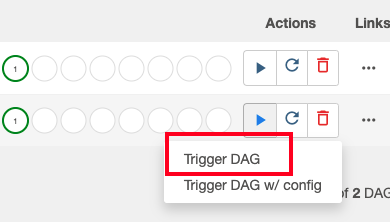

# About

This module covers deploying the "Hello World" DAG, and executing the same, manually, in a secure cluster.<br>

<hr>

## Prerequisites
All the prior modules.

<hr>

## 1. Deploy the DAG to a secure Cloud Composer 2

a) Navigate to the scripts directory cloned in cloud shell-
```
cd ~/cloud-composer-setup-foundations/02-dags/00-hello-world-dag/1-dag-base
```

b) Declare variables-
```
PROJECT_KEYWORD="thor"  # Replace with your keyword from module 1

ORG_ID=akhxxxxkar.altostrat.com                              #Replace with yours
ORG_ID_NBR=xxxxxxx                                      #Replace with yours

SVC_PROJECT_NUMBER=xxxxxxxx                              #Replace with yours
SVC_PROJECT_ID=$PROJECT_KEYWORD-svc-proj                     

SHARED_VPC_HOST_PROJECT_ID=$PROJECT_KEYWORD-host-proj        #Shared VPC project - replace with yours
SHARED_VPC_HOST_PROJECT_NUMBER=23xxxx3145                  #Shared VPC project - replace with yours


UMSA="$PROJECT_KEYWORD-sa"
UMSA_FQN=$UMSA@$SVC_PROJECT_ID.iam.gserviceaccount.com
COMPOSER_ENV_NM=cc2-$PROJECT_KEYWORD-secure
LOCATION=us-central1
```

c) Run the below command to deploy the DAG

```
gcloud composer environments storage dags import \
--environment $COMPOSER_ENV_NM  --location $LOCATION \
--source hello-world-dag.py  \
--impersonate-service-account $UMSA_FQN
```

<hr>

## 2. The DAG deployment

### 2.1. Check the Cloud Composer GCS bucket DAG folder


### 2.2. Switch to the Airflow web UI and check for the DAG


<hr>

## 3. Execute the DAG and check results


### 3.1. Notice the new DG deployed show up in the DAG listing. Also, look at the "Run" button.


<br><br>

### 3.2. Trigger the DAG as shown below




<br><br>

### 3.3. Notice the run show up with a light green cricle on the run number


<br><br>

### 3.4. Switch to "Graph" view


<br><br>

### 3.5. Click on the node "print_dag_run_conf"


<br><br>

### 3.6. Click on logs


<br><br>

### 3.7. Notice that there are run attempts, and in the first attempt, the output with "Hello World"...


## 4.0. What's next?

Event-driven orchestration samples..
1. GCS bucket event driven orchestration
2. Pub/Sub message event driven orchestration

<hr>

Proceed to the [next module](02d-secure-cc2-iteration1-HWD-GCS-EDO.md).
