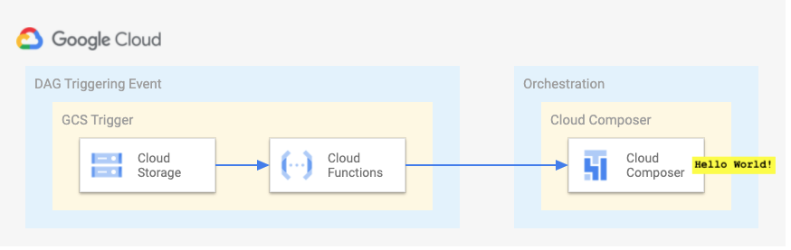
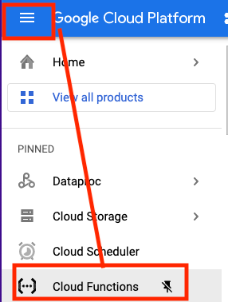
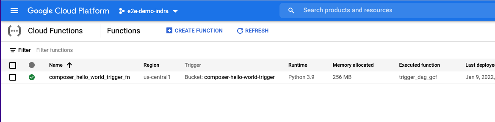
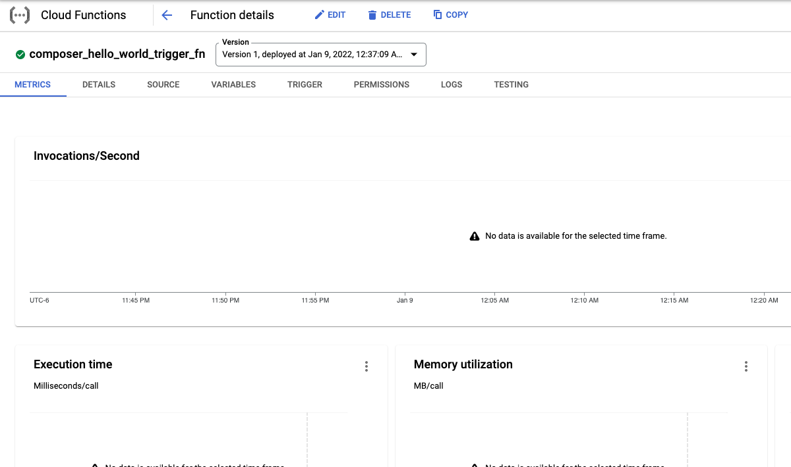
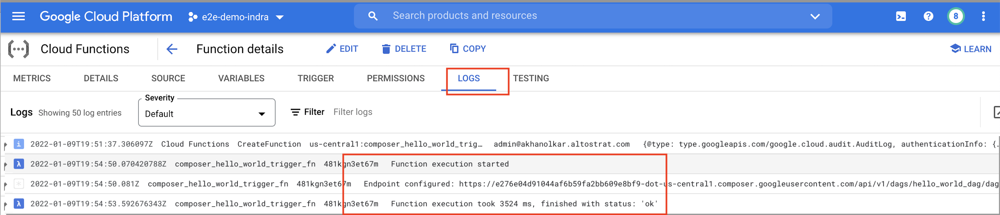
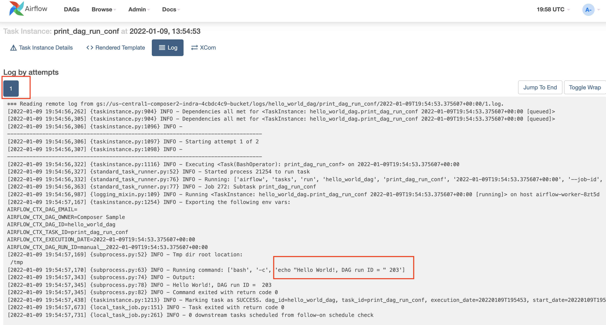

# About

This module builds on the "Hello World" exercise, by adding the GCS bucket event driven orchestration element to it.<br>
FIRST and foremost - read this [GCP documentation](https://cloud.google.com/composer/docs/composer-2/triggering-with-gcf) to get an understanding of what we are about to attempt. And...here is a pictorial overview. <br>




<br>

**Purpose of the module:**<br>
The purpose of this module is to ensure that GCS bucket event driven orchestration works in a secure Cloud Composer setup. <br>

<hr>


## 1.0. Variables

From cloud shell, run the commands below in the service project-

```
# Replace with your keyword from module 1
PROJECT_KEYWORD="thor"  

#Replace with yours
ORG_ID=akhanolkar.altostrat.com                              
ORG_ID_NBR=236589261571                                      

#Replace with yours
SVC_PROJECT_NUMBER=509862753528                             
SVC_PROJECT_ID=$PROJECT_KEYWORD-svc-proj                     

#Replace with yours
SHARED_VPC_HOST_PROJECT_ID=$PROJECT_KEYWORD-host-proj        
SHARED_VPC_HOST_PROJECT_NUMBER=239457183145                  


LOCATION=us-central1

#Replace with yours
ADMIN_UPN_FQN=admin@$ORG_ID 

SVC_PROJECT_UMSA="$PROJECT_KEYWORD-sa"
SVC_PROJECT_UMSA_FQN=$SVC_PROJECT_UMSA@$SVC_PROJECT_ID.iam.gserviceaccount.com

COMPOSER_ENV_NM=cc2-$PROJECT_KEYWORD-secure

GCF_TRIGGER_BUCKET_FQN=gs://cc2-hw-trigger-bucket-$SVC_PROJECT_NUMBER
DAG_ID=hello_world_dag


AIRFLOW_URI=`gcloud composer environments describe $COMPOSER_ENV_NM \
    --location $LOCATION \
    --format='value(config.airflowUri)'`
```

Validate:
```
echo $AIRFLOW_URI
```

The author's result-
```
https://xxXXXXXXX09e8bf9-dot-us-central1.composer.googleusercontent.com
```
<hr>


## 2.0. Create a GCS trigger bucket
```
gsutil mb -p $SVC_PROJECT_ID -c STANDARD -l $LOCATION -b on $GCF_TRIGGER_BUCKET_FQN
```

<hr>

## 3.0. Review the Airflow DAG executor script

In cloud shell, navigate to the scripts directory for the exercise-
```
cd ~/cloud-composer-setup-foundations/02-dags/00-hello-world-dag/2-dag-gcs-orchestrated
```

Open and review the script below-
```
cat composer2_airflow_rest_api.py
```

Do not change any variables.<br>
The Cloud Function we will author, imports this file from the main.py file.

<hr>

## 4.0. Review the Python dependencies file

Open and review the script below-
```
cat requirements.txt
```

<hr>

## 5.0. Review the GCF main python file

Open and review the script below-
```
cat main.py
```

Notice that there are two variables to be replaced-<br>
AIRFLOW_URI_TO_BE_REPLACED<br>
and<br>
DAG_ID_TO_BE_REPLACED<br>

<hr>

## 6.0. Update the GCF main python file

1. Replace WEB_SERVER_URL_TO_BE_REPLACED in main.py with your env specific value

```
sed -i "s|AIRFLOW_URI_TO_BE_REPLACED|$AIRFLOW_URI|g" main.py
```


2. Replace DAG_NAME_TO_BE_REPLACED in main.py with your env specific value
```
sed -i "s|DAG_ID_TO_BE_REPLACED|$DAG_ID|g" main.py
```


3. Validate
```
cat main.py
```

You should see the actual Airflow URI and the DAG ID replaced in the code

```
def trigger_dag_gcf(data, context=None):
    """
    ....
    web_server_url = (
        'https://xxxxxx-dot-us-central1.composer.googleusercontent.com'
    )
    # Replace with the ID of the DAG that you want to run.
    dag_id = 'hello_world_dag'

    ...
```

<hr>


## 7.0. Deploy the Google Cloud Function (GCF) to run as UMSA

Takes approximately 2 minutes.

```
gcloud functions deploy cc2_hw_gcs_trigger_fn \
--entry-point trigger_dag_gcf \
--trigger-resource $GCF_TRIGGER_BUCKET_FQN \
--trigger-event google.storage.object.finalize \
--runtime python39   \
--vpc-connector projects/$SHARED_VPC_HOST_PROJECT_ID/locations/$LOCATION/connectors/$PROJECT_KEYWORD-gcf-vpc-cnnctr \
--service-account=${SVC_PROJECT_UMSA_FQN}
```

<hr>

## 8.0. Validate function deployment and configuration in the Cloud Console

a) In the cloud console, navigate to Cloud Functions-


<br><br><br>

b) Click on the deployed function

<br><br><br>

c) Review the various tabs


<hr>


## 9.0.Test the function from cloud shell

### 9.0.1. Create a trigger file in GCS
```
touch dummy.txt
gsutil cp dummy.txt $GCF_TRIGGER_BUCKET_FQN
rm dummy.txt
```

### 9.0.2. Validate successful GCF execution

Go to the Cloud Function Logs, in the cloud console and check for errors..


<br>

And then go to Airflow web UI and click on the DAG node, and look at the logs...

<br>

<hr>

This concludes the lab module. Proceed to the [next module](02e-secure-cc2-iteration1-HWD-PubSub-EDO.md).
