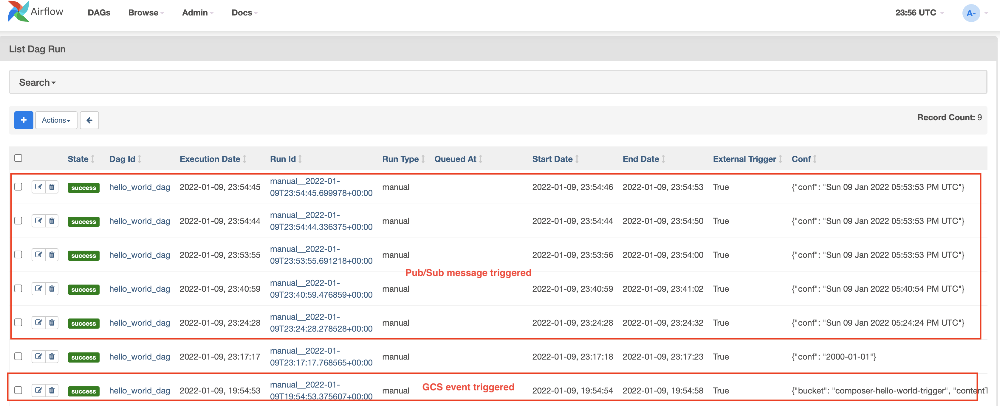

# About

This module builds on the "Hello World" exercise, by adding the orchestration element to it.<br>
Specifically, Pub/Sub message event driven orchestration.<br>


## 1.0. Variables

Note: We already enabled the Pub/Sub API in the prerequisites module. <br>
From cloud shell, run the commands below-

a) The variables
```
# Replace with your keyword from module 1
PROJECT_KEYWORD="thor"  

#Replace with yours
ORG_ID=akhanolkar.altostrat.com                             
ORG_ID_NBR=236589261571                                      

#Replace with yours
SVC_PROJECT_NUMBER=509862753528                              
SVC_PROJECT_ID=$PROJECT_KEYWORD-svc-proj                     

#Replace with yours
SHARED_VPC_HOST_PROJECT_ID=$PROJECT_KEYWORD-host-proj        
SHARED_VPC_HOST_PROJECT_NUMBER=239457183145                 


LOCATION=us-central1

#Replace with yours if its a different construct
ADMIN_UPN_FQN=admin@$ORG_ID 

SVC_PROJECT_UMSA="$PROJECT_KEYWORD-sa"
SVC_PROJECT_UMSA_FQN=$SVC_PROJECT_UMSA@$SVC_PROJECT_ID.iam.gserviceaccount.com

COMPOSER_ENV_NM=cc2-$PROJECT_KEYWORD-secure

PUBSUB_TRIGGER_TOPIC=cc2-hw-trigger-topic-$SVC_PROJECT_NUMBER
DAG_ID=hello_world_dag

AIRFLOW_URI=`gcloud composer environments describe $COMPOSER_ENV_NM \
    --location $LOCATION \
    --format='value(config.airflowUri)'`
```

## 2.0. Create a Google Pub/Sub topic
```
gcloud pubsub topics create $PUBSUB_TRIGGER_TOPIC
```


## 3.0. Review the Airflow DAG executor script

In cloud shell, navigate to the scripts directory for the exercise-
```
cd ~/cloud-composer-setup-foundations/02-dags/00-hello-world-dag/3-dag-pubsub-orchestrated
```

Open and review the script below-
```
cat composer2_airflow_rest_api.py
```

Do not change any variables.<br>
The Cloud Function we will author, imports this file from the main.py file.

## 4.0. Review the Python dependencies file

Open and review the script below-
```
cat requirements.txt
```

## 5.0. Review the GCF main python file

Open and review the script below-
```
cat main.py
```

Notice that there are two variables to be replaced-<br>
AIRFLOW_URI_TO_BE_REPLACED<br>
and<br>
DAG_ID_TO_BE_REPLACED<br>

## 6.0. Update the GCF main python file

1. Replace WEB_SERVER_URL_TO_BE_REPLACED in main.py with your env specific value

```
sed -i "s|AIRFLOW_URI_TO_BE_REPLACED|$AIRFLOW_URI|g" main.py
```

2. Replace DAG_NAME_TO_BE_REPLACED in main.py with your env specific value
```
sed -i "s|DAG_ID_TO_BE_REPLACED|$DAG_ID|g" main.py
```

3. Validate
```
cat main.py
```

You should see the actual Airflow URI and the DAG ID

## 7.0. Deploy the Google Cloud Function (GCF) to run as UMSA

Takes approximately 2 minutes.

```
gcloud functions deploy cc2_hw_pubsub_trigger_fn \
--entry-point trigger_dag_gcf \
--trigger-topic $PUBSUB_TRIGGER_TOPIC \
--runtime python39 \
--service-account=${SVC_PROJECT_UMSA_FQN} \
--vpc-connector projects/$SHARED_VPC_HOST_PROJECT_ID/locations/$LOCATION/connectors/$PROJECT_KEYWORD-gcf-vpc-cnnctr 

```

a) In the cloud console, navigate to Cloud Storage-

<br><br><br>

b) In the cloud console, navigate to Cloud Functions-

<br><br><br>

Browse through the tabs-

<br><br><br>

<br><br><br>

<br><br><br>

<br><br><br>

<br><br><br>

<br><br><br>

<br><br><br>

## 8.0.Test the function from cloud shell

```
CURRENT_TIME=`date -d "-6 hours"`
gcloud pubsub topics publish $PUBSUB_TRIGGER_TOPIC --message "$CURRENT_TIME"
```

Go to the Cloud Function Logs, in the cloud console and check for errors..


<br>

And then go to Airflow web UI and click on the DAG node, and look at the logs...

<br>

Publish multiple messages to the Pub/Sub topic and explore DAG runs in the Airflow UI...

<br>

## 9.0. Lets do a quick review of permissions for the major identities in scope for this demo

Go to the Cloud Console and navigate to the IAM -> IAM & Admin and ensure you check the "Include Google Provided Role Grants". Screenshots of what you should expect are below. 

## 9.0.1. The lab attendee permissions

<br>

## 9.0.2. The UMSA permissions

<br>

## 9.0.3. The Cloud Composer Service Agent Account permissions

<br>

## 9.0.4. The various Google Managed Default Service Accounts

<br>


<hr>

This concludes this module. Please proceed to the [next module](02f-secure-cc2-iteration1-MVDD.md).

