# About

This module covers creating an ultra basic DAG that reads a CSV file from GCS, transforms it and loads it into BigQuery from Cloud Dataflow. It is based off of a [sample in the GCP documentation](https://cloud.google.com/composer/docs/how-to/using/using-dataflow-template-operator), with some enhancements such as BYO VPC subnet, use a service account etc.

Here is a pictorial overview of the DAG-
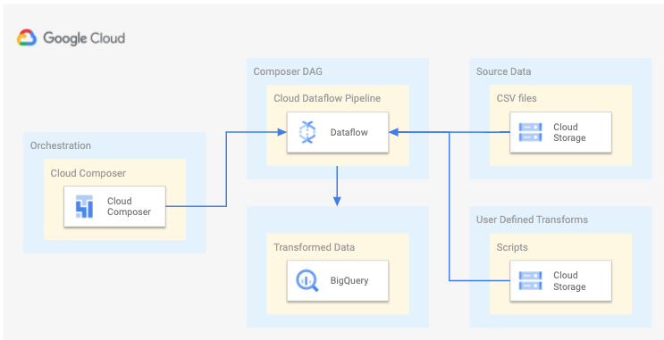

### Prerequisites
Successful completion of prior modules.

## 1. Review the DAG script

a) From cloud shell, navigate to the directory where the script is located
```
cd ~/cloud-composer-setup-foundations/02-dags/01-min-viable-data-dag/00-scripts
```

b) Review the DAG Python script "min-viable-data-dag.py"<br>

It reads files from GCS, maps/transforms and loads the data into BigQuery, via Cloud Dataflow.<br>
It uses a Dataflow template available in Cloud storage for the same.<br>
This template accepts parameters for the transformation function, source and sink paths and such.<br>

## 2. Variables for the lab

In cloud shell, lets define variables to use

```
PROJECT_KEYWORD="thor"  # Replace with your keyword from module 1


ORG_ID=akhanolkar.altostrat.com                              #Replace with yours
ORG_ID_NBR=236589261571                                      #Replace with yours

SVC_PROJECT_NUMBER=509862753528                              #Replace with yours
SVC_PROJECT_ID=$PROJECT_KEYWORD-svc-proj                     #Data analytics service project

SHARED_VPC_HOST_PROJECT_ID=$PROJECT_KEYWORD-host-proj        #Shared VPC project - replace with yours
SHARED_VPC_HOST_PROJECT_NUMBER=239457183145                  #Shared VPC project - replace with yours


LOCATION=us-central1

ADMIN_UPN_FQN=admin@$ORG_ID #Replace with yours if its a different construct
SVC_PROJECT_UMSA="$PROJECT_KEYWORD-sa"
SVC_PROJECT_UMSA_FQN=$SVC_PROJECT_UMSA@$SVC_PROJECT_ID.iam.gserviceaccount.com

COMPOSER_ENV_NM=cc2-$PROJECT_KEYWORD-secure

USE_PUBLIC_IPS_IN_DATAFLOW="false"
DATAFLOW_SUBNET_FQN="https://www.googleapis.com/compute/v1/projects/$SHARED_VPC_HOST_PROJECT_ID/regions/$LOCATION/subnetworks/$PROJECT_KEYWORD-shared-cc2-snet"

SRC_FILE_STAGING_BUCKET_PATH=gs://cc2-mvp-dag-src-$SVC_PROJECT_ID
BQ_DATASET_NM=average_weather_ds
BQ_TABLE_NM=average_weather

```

## 3. Create a BigQuery dataset and table

From cloud shell, run the commands below.

### 3.1. Create the dataset
```
bq --location=$LOCATION mk \
--dataset \
$PROJECT_ID:$BQ_DATASET_NM
```

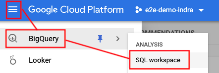
<br><br>

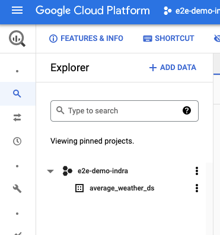
<br>

### 3.2. Create the table
```
bq mk \
--table \
$PROJECT_ID:$BQ_DATASET_NM.$BQ_TABLE_NM \
location:GEOGRAPHY,average_temperature:INTEGER,month:STRING,inches_of_rain:NUMERIC,is_current:BOOLEAN,latest_measurement:DATE
```

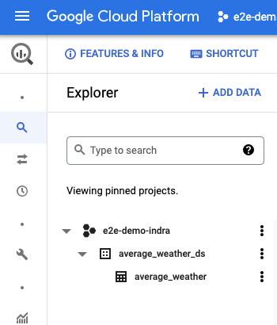
<br><br>

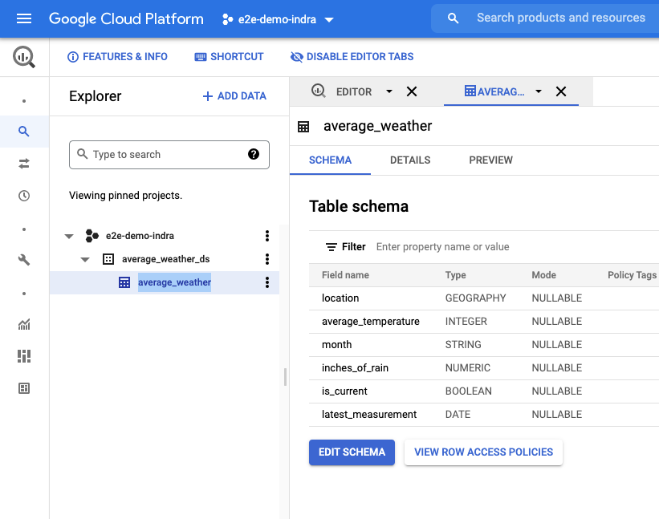
<br>


### 3.3. Grant IAM permissions for the user managed service account to BigQuery

Grant BQ data editor role
```
gcloud projects add-iam-policy-binding $SVC_PROJECT_ID --member=serviceAccount:$UMSA_FQN \
--role="roles/bigquery.dataEditor"
```

Grant BQ admin role (sounds excessive, but is the only way it works)
```
gcloud projects add-iam-policy-binding $SVC_PROJECT_ID --member=serviceAccount:$UMSA_FQN \
--role="roles/bigquery.admin"
```

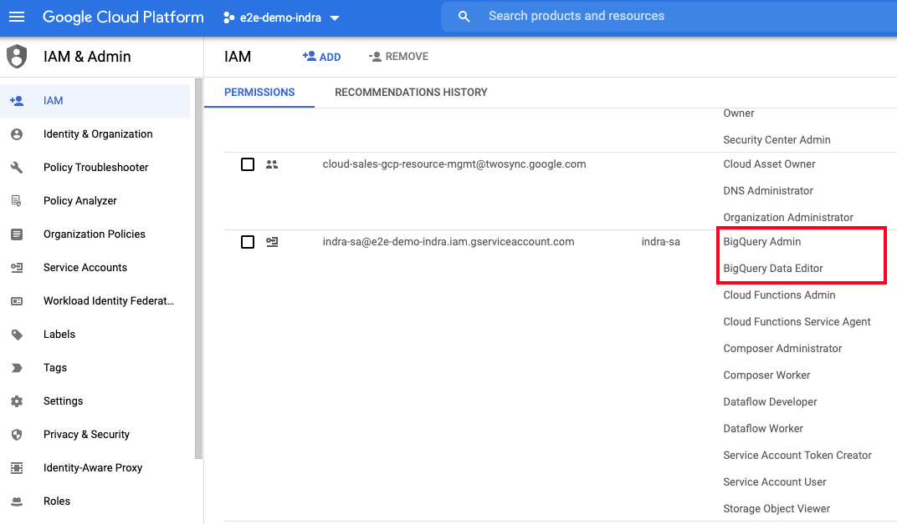
<br>

## 4. Create a GCS bucket, stage the source files, and grant IAM permissions 

### 4.1. Create the bucket from cloud shell
```
gsutil mb -c standard -p $SVC_PROJECT_ID -l $LOCATION $SRC_FILE_STAGING_BUCKET_PATH
```


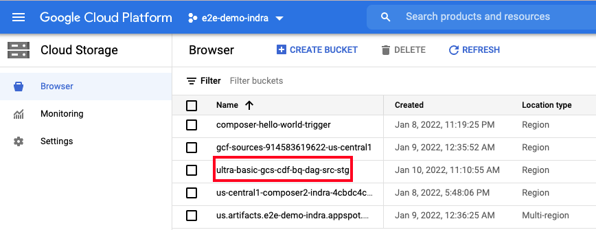
<br>

### 4.2. Review the files, and understand their purpose

1) Navigate to the local directory in the Git repo cloned, in cloud shell-
```
cd ~/cloud-composer-setup-foundations/02-dags/01-min-viable-data-dag/01-source-files
```

2) Review data file - inputFile.txt
```
POINT(40.7128 74.006),45,'July',2,true,2020-02-16
POINT(41.8781 87.6298),23,'October',13,false,2015-02-13
POINT(48.8566 2.3522),80,'December',8,true,2022-01-10
POINT(6.5244 3.3792),15,'March',14,true,2021-01-01
```

3) Review the schema file - jsonSchema.json<br>

The data above does not make sense without a schema; Lets review the schema file needed for Cloud dataflow, to read, parse, map, transform and load to BigQuery
```
{
    "BigQuery Schema": [
    {
        "name": "location",
        "type": "GEOGRAPHY",
        "mode": "REQUIRED"
    },
    {
        "name": "average_temperature",
        "type": "INTEGER",
        "mode": "REQUIRED"
    },
    {
        "name": "month",
        "type": "STRING",
        "mode": "REQUIRED"
    },
    {
        "name": "inches_of_rain",
        "type": "NUMERIC"
    },
    {
        "name": "is_current",
        "type": "BOOLEAN"
    },
    {
        "name": "latest_measurement",
        "type": "DATE"
    }]
}
```
5) Review the JSON transform function - transformCSVtoJSON.js<br>

This function just splits the data in the file, into an object, and finally returns it as a JSON string-
```
function transformCSVtoJSON(line) {
var values = line.split(',');

var obj = new Object();
obj.location = values[0];
obj.average_temperature = values[1];
obj.month = values[2];
obj.inches_of_rain = values[3];
obj.is_current = values[4];
obj.latest_measurement = values[5];

var jsonString = JSON.stringify(obj);

return jsonString;
}
```


### 4.3. Copy the source files to the staging bucket
```

cd ~/cloud-composer-setup-foundations/02-dags/01-min-viable-data-dag/01-source-files
gsutil cp jsonSchema.json $SRC_FILE_STAGING_BUCKET_PATH
gsutil cp transformCSVtoJSON.js $SRC_FILE_STAGING_BUCKET_PATH
gsutil cp inputFile.txt $SRC_FILE_STAGING_BUCKET_PATH
```

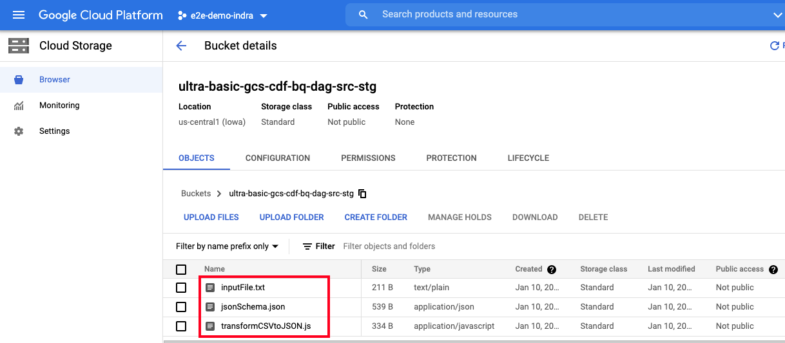
<br>

### 4.4. Grant IAM permissions 
The UMSA will execute the Composer pipeline that uses a Dataflow template that reads from GCS, as the user managed service account (UMSA).
So, we will need to grant the UMSA the permissions to access the bucket.
```
gcloud projects add-iam-policy-binding $SVC_PROJECT_ID --member=serviceAccount:$UMSA_FQN \
--role="roles/storage.objectViewer"
```

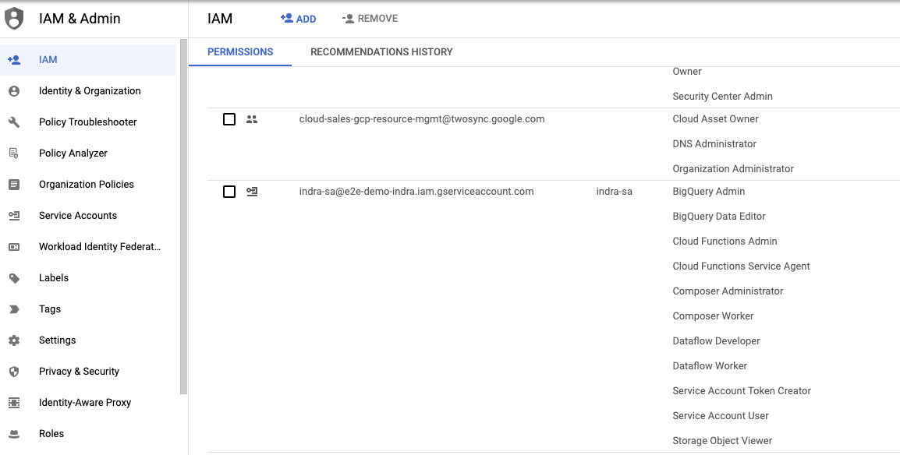
<br>

## 5. Cloud Dataflow specific permissions

The Composer DAG launches Cloud Dataflow which uses a Dataflow template - therefore no code walk through of Dataflow job.<br> 
We will run Composer as the UMSA.<br> 
Therefore, we will need to grant the **UMSA**, the requisite permissions.<br>

1) Dataflow developer role
```
gcloud projects add-iam-policy-binding $SVC_PROJECT_ID --member=serviceAccount:$UMSA_FQN \
--role="roles/dataflow.developer"
```

2) Dataflow worker role
```
gcloud projects add-iam-policy-binding $SVC_PROJECT_ID --member=serviceAccount:$UMSA_FQN \
--role="roles/dataflow.worker"
```

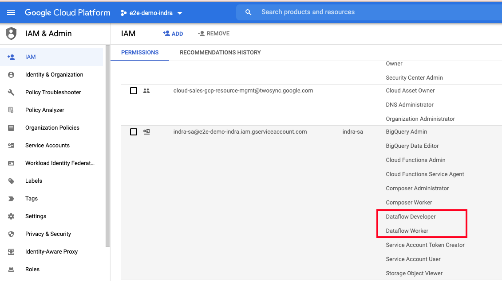
<br>

## 6. BigQuery specific permissions

The Cloud Dataflow template persis to BigQuery and we will run the DAG as the UMSA. Therefore, we will need to grant the **UMSA**, the requisite permissions.<br>

1) BigQuery admin role
```
gcloud projects add-iam-policy-binding $SVC_PROJECT_ID --member=serviceAccount:$UMSA_FQN \
--role="roles/bigquery.admin"
```

2) BigQuery data editor role
```
gcloud projects add-iam-policy-binding $SVC_PROJECT_ID --member=serviceAccount:$UMSA_FQN \
--role="roles/bigquery.dataEditor"
```

## 7. Configure Composer Environment Variables
The DAG expects some environment variables.<br>
Lets set the same.<br>


### 7.1. Private Cloud Composer 2 Specific - for running via Cloud Shell (not practical)
To allow yourself to access a secure Cloud Composer cluster from gcloud, lets capture the non-static IP granted to cloud shell and add it to the authorized networks-

a) Your Cloud Shell IP address-
```
MY_CLOUD_SHELL_IP=$(dig +short myip.opendns.com @resolver1.opendns.com)
```

b) The Cloud Composer GKE cluster
```
CC2_GKE_CLUSTER=`gcloud container clusters list | grep NAME | cut -d":" -f2 | sed 's/^ *//g'`
```

c) Existing authorized networks
```
EXISTING_CIDR=`gcloud container clusters describe $CC2_GKE_CLUSTER --format "flattened(masterAuthorizedNetworksConfig.cidrBlocks[])" --region us-central1 | cut -d":" -f2 | sed 's/^ *//g'`
```

d) Update authorized networks to include your cloud shell IP address
```
gcloud container clusters update $CC2_GKE_CLUSTER \
    --enable-master-authorized-networks \
    --master-authorized-networks ${EXISTING_CIDR},${MY_CLOUD_SHELL_IP}/32 \
    --region $LOCATION
```

e) Update the firewall rule for the subnet hosting the GKE cluster to allow your cloud shell IP address (

### 7.2. Create environment variables

To create these varibles, you need to either run from Cloud shell after completing the steps above, or from your permitted, GKE authorized network.<br>

1) Project ID
```
gcloud composer environments run $COMPOSER_ENV_NM \
  --location $LOCATION \
  variables set -- \
  project_id $SVC_PROJECT_ID
```

2) GCS bucket path for source files
```
gcloud beta composer environments run $COMPOSER_ENV_NM \
--location $LOCATION \
variables set -- \
source_file_bucket_path $SRC_FILE_STAGING_BUCKET_PATH
```

3) Subnet to deploy Dataflow into
```
gcloud beta composer environments run $COMPOSER_ENV_NM \
--location $LOCATION \
variables set -- \
dataflow_subnet $DATAFLOW_SUBNET_FQN
```

4) max_active_runs_per_dag
```
gcloud beta composer environments run $COMPOSER_ENV_NM \
--location $LOCATION \
variables set -- \
max_active_runs_per_dag 1
```

5) BigQuery dataset name
```
gcloud beta composer environments run $COMPOSER_ENV_NM \
--location $LOCATION \
variables set -- \
bq_ds $BQ_DATASET_NM
```

6) BigQuery table name
```
gcloud beta composer environments run $COMPOSER_ENV_NM \
--location $LOCATION \
variables set -- \
bq_tbl_nm $BQ_TABLE_NM
```

7) User Managed Service Account (UMSA) Fully Qualified Name (FQN)
```
gcloud beta composer environments run $COMPOSER_ENV_NM \
--location $LOCATION \
variables set -- \
umsa_fqn $UMSA_FQN
```

8) Boolean to indicate whether to have Dataflow be public/private IP based
```
gcloud beta composer environments run $COMPOSER_ENV_NM \
--location $LOCATION \
variables set -- \
use_public_ips_in_dataflow $USE_PUBLIC_IPS_IN_DATAFLOW
```


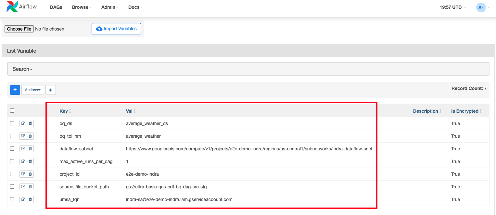
<br>

## 8. Deploy the DAG to Cloud Composer 2

Run the below command to deploy the DAG

```
cd ~/cloud-composer-setup-foundations/02-dags/01-min-viable-data-dag/00-scripts/
```

```
gcloud composer environments storage dags import \
--environment $COMPOSER_ENV_NM  --location $LOCATION \
--source min-viable-data-dag.py \
--impersonate-service-account $UMSA_FQN
```

Review the deployment in the Cloud Console, in Cloud Storage.
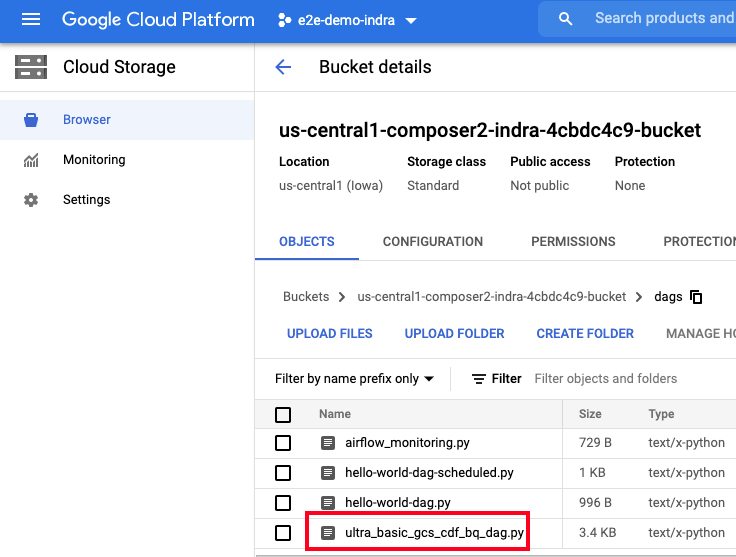
<br>


## 9. Switch to the Cloud Composer Aiflow Web UI and view the DAG execution and check results

Switch to Airflow UI, you should see the new DAG executing
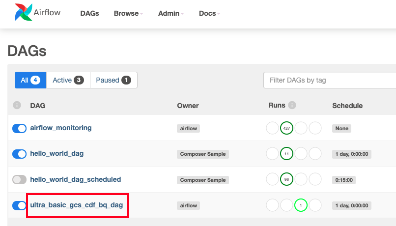
<br>


## 10. Switch to the Cloud Dataflow UI and view the pipeline execution 

Switch to the Cloud Console, and navigate to Cloud Dataflow-
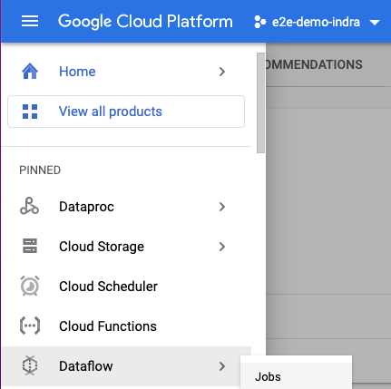
<br>


Notice that the Dataflow job has started
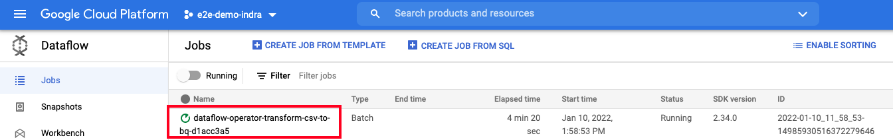
<br>

Explore the DAG
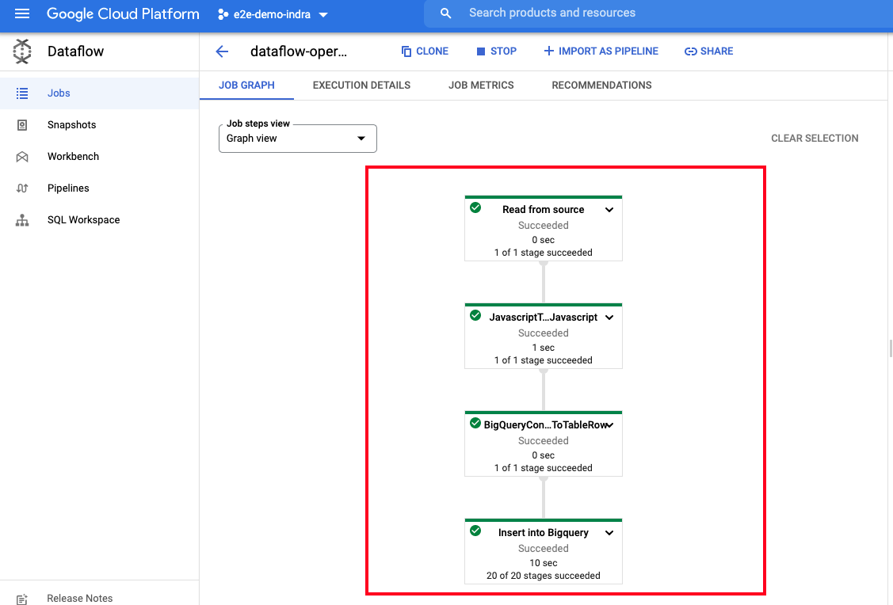
<br>

Explore the DAG execution logs
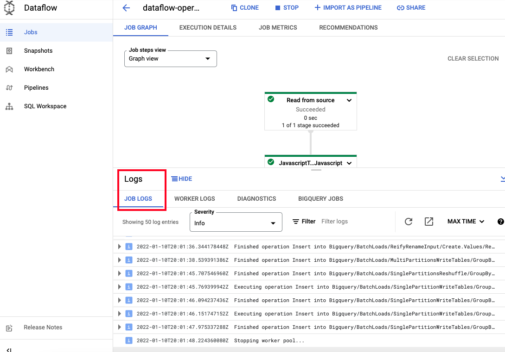
<br>


## 11. Switch to the BigQuery UI and view the results

Switch to BigQuery in the Cloud Console and run the query-
```
select * from `average_weather_ds.average_weather`
```

You should see the following results-


Explore the DAG execution logs
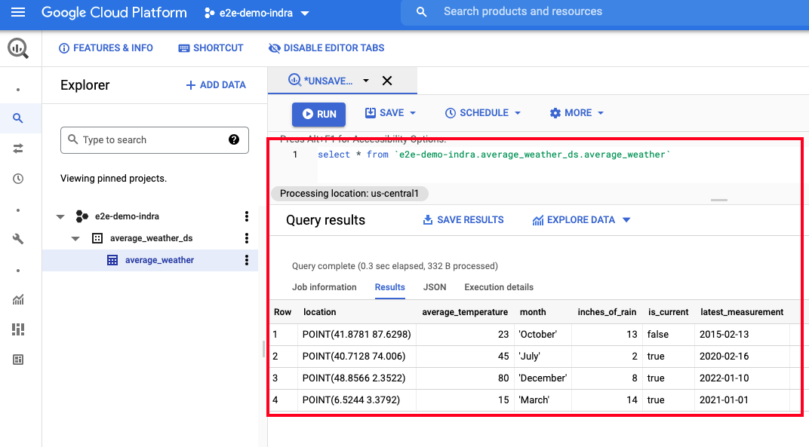
<br>


## 13. Want a challenge?

1) Add some data into inputFile.txt that has "null" for some columns
2) Edit the transformation Javascript function to set defaults to load into BigQuery
3) Configure event driven orchestration of th DAG with a Cloud Storage event 
4) Configure event driven orchestration of th DAG with a Cloud Pub/Sub event 

<hr>

This concludes the module, please proceed to the [next module](03-secure-cc2-iteration2-foundations.md).
