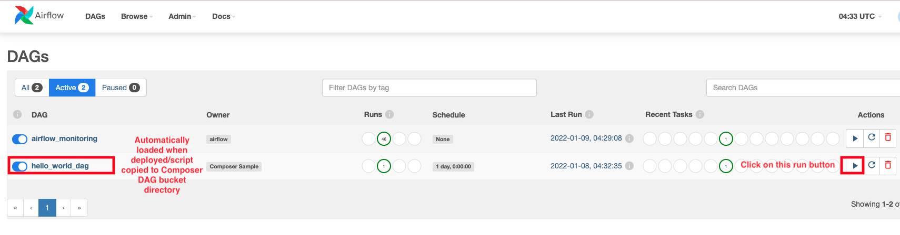
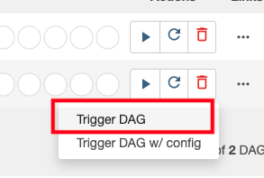
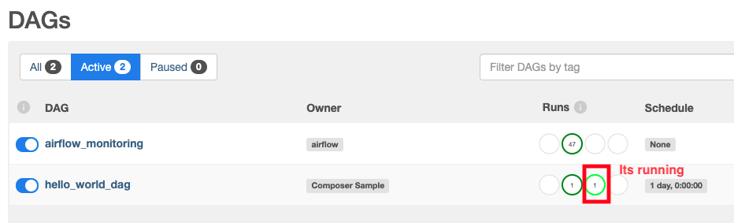
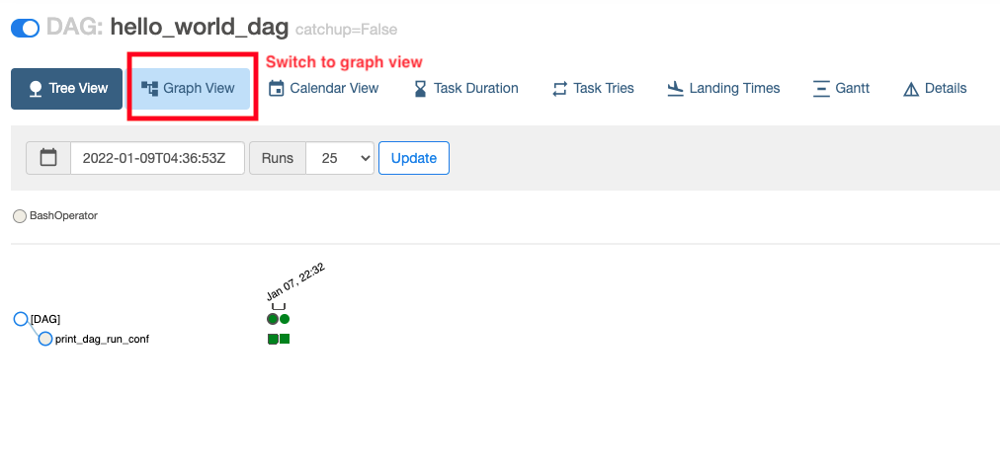
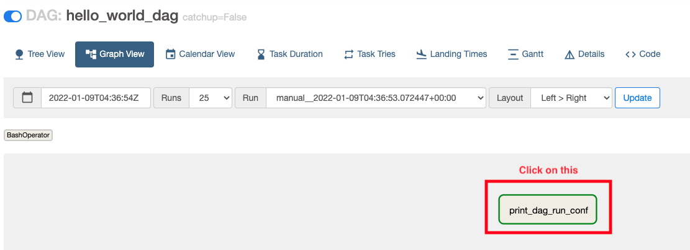
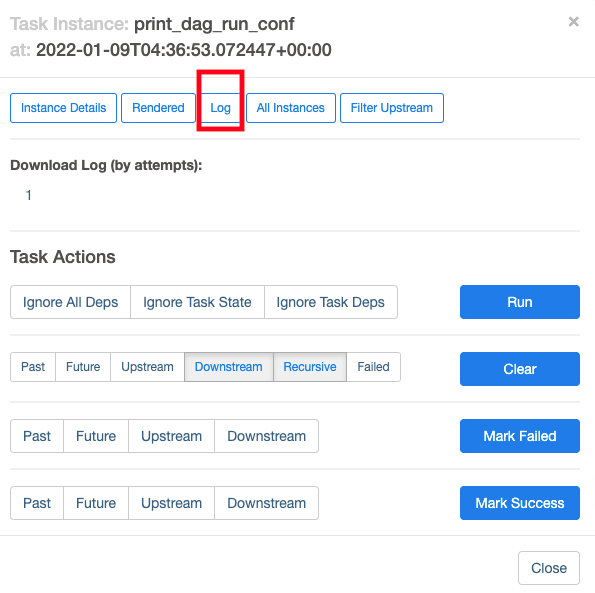
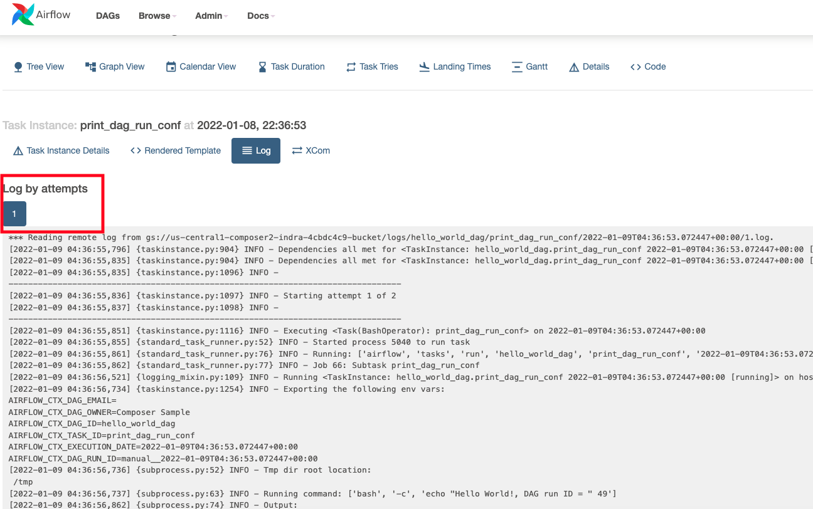
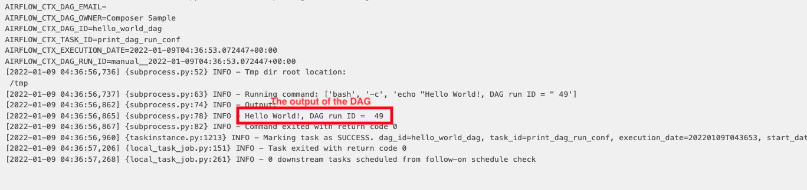

# About

This module covers deploying a "Hello World" DAG, and executing the same, manually, in a secure cluster.<br>

## Duration 
~ 30 minutes or less

## Skill Level
Low

## Goal
The attendee should be able to create a very basic DAG successfully in a secure Cloud Composer 2 cluster.

## Note
This lab needs to be run in the data analytics project (e2e-demo-indra, in the author's case).

## Prerequisites
All the prior modules.

## 1. Deploy the DAG to a secure Cloud Composer 2

Navigate to the scripts directory cloned in cloud shell-
```
cd ~/e2e-demo-indra/03-Cloud-Composer2/01-hello-world-dag/00-scripts/1-dag-base/
```

Run the below command to deploy the DAG

```
PROJECT_ID=e2e-demo-indra 
UMSA="indra-sa"
UMSA_FQN=$UMSA@$PROJECT_ID.iam.gserviceaccount.com
COMPOSER_ENV_NM=cc2-indra-secure
LOCATION=us-central1

gcloud composer environments storage dags import \
--environment $COMPOSER_ENV_NM  --location $LOCATION \
--source hello-world-dag.py  \
--impersonate-service-account $UMSA_FQN
```

## 2. Switch to the Cloud Composer Aiflow Web UI and execute the DAG and check results


### 2.1. Notice the new DG deployed show up in the DAG listing. Also, look at the "Run" button.



<br><br>

### 2.2. Trigger the DAG as shown below



<br><br>

### 2.3. Notice the run show up with a light green cricle on the run number



<br><br>

### 2.4. Switch to "Graph" view



<br><br>

### 2.5. Click on the node "print_dag_run_conf"




<br><br>

### 2.6. Click on logs



<br><br>

### 2.7. Notice that there are run attempts, scroll on the attempt 1



<br><br>

### 2.8. The output with "Hello World"...



## 3.0. What's next?

Event-driven orchestration samples..
1. GCS bucket event driven orchestration
2. Pub/Sub message event driven orchestration
